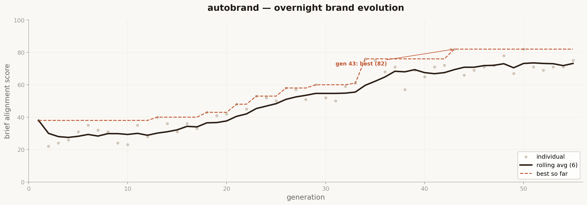

# autobrand



*There was a time when brand identity was a 6-week engagement. A designer would meet the founders, absorb their energy, disappear into a cave, and emerge with three directions on a Monday morning. The founders would pick one. The designer would refine it. Everyone would call it "the brand." That era is ending. Not because the craft doesn't matter. Because the craft is moving up a level. The designer doesn't make the identity anymore. The designer writes the brief that teaches the machine what the identity should feel like. The taste is still human.*

The idea: write a brand brief in plain language. Hand it to an AI agent. Walk away. The agent generates brand identity elements, scores them against your brief using a vision+language model, keeps what works, discards what doesn't, mutates the survivors, and repeats. You wake up to a complete identity system and the full evolution log showing how it got there.

You don't design the brand. You design the brief. The brief is the product.

## How it works

Four files that matter:

- **`brief.md`** — the brand brief. This is the only file you write. Who it's for, what it stands for, what it should feel like, what it should never feel like. Constraints, references, anti-references. This is your taste, encoded as text.
- **`generate.py`** — reads the brief and produces brand artifacts: color palettes, typography pairings, logo concepts (SVG), voice samples (taglines, microcopy, tone). Also handles mutations between generations using critique feedback.
- **`score.py`** — evaluates each generation against the brief using a vision+language model. Returns a single alignment score (0-100) plus a written critique. The critique gets fed back into the next generation as creative direction.
- **`evolve.py`** — the loop. Generate → render → score → keep or discard → mutate → repeat. Run it, go to sleep. Each cycle takes ~90 seconds. That's ~40 generations per hour, ~300+ overnight.

Every generation gets saved to `/history` with its full artifacts, score, and critique. The history folder IS the case study.

## The brief is the design

Here's what's actually happening. In traditional brand design, the designer's value lives in two places: taste (knowing what good looks like) and execution (making the thing). This repo automates execution. What's left is taste. And taste lives in the brief.

A bad brief produces a bad brand, no matter how many generations you run. A great brief produces something that feels like it was designed by someone who understands the problem deeply. Because it was. You just didn't push the pixels.

This is the same shift Karpathy's [autoresearch](https://github.com/karpathy/autoresearch) demonstrated for ML research. The researcher stopped writing Python and started writing `program.md`. The designer stops pushing pixels and starts writing `brief.md`. The skill moves up one abstraction layer. It doesn't disappear. It concentrates.

## Quick start

**Requirements:** Python 3.10+, [uv](https://docs.astral.sh/uv/), an Anthropic API key (Claude is used for both generation and scoring).

```bash
# 1. Install uv (if you don't have it)
curl -LsSf https://astral.sh/uv/install.sh | sh

# 2. Install dependencies
uv sync

# 3. Set your API key
export ANTHROPIC_API_KEY=sk-ant-...

# 4. Edit brief.md with your brand brief
# (a sample brief is included)

# 5. Run a single generation to test
uv run generate.py

# 6. Run the evolution loop (this is the main event)
uv run evolve.py
```

Leave `evolve.py` running overnight. Check `/history` in the morning.

## What the agent produces each generation

Every cycle generates a complete identity snapshot:

| Artifact | Format | What it is |
|----------|--------|------------|
| Color palette | JSON + SVG swatch | 5 colors: primary, secondary, accent, neutral, background |
| Typography | JSON | Heading + body + functional font pairing with size scale |
| Logomark | SVG | Abstract mark, wordmark, or monogram (agent decides) |
| Voice samples | JSON | 3 taglines, 3 microcopy examples, tone description |
| Brand board | SVG | A composed board combining all elements into one view |

Each artifact includes the agent's reasoning for why it made that choice relative to the brief.

## Scoring

The scoring model receives:
1. The original brief
2. The composed brand board (SVG)
3. All artifact data as structured JSON

It evaluates against six weighted criteria:

**Brief Alignment (30 points)** — Does the identity match what the brief asked for? Does it capture the feeling, not just the literal words? Does it avoid the anti-references?

**Color & Palette (15 points)** — Do the colors work harmonically? Do they meet contrast requirements? Would they work across light and dark contexts?

**Typography (15 points)** — Does the type system have hierarchy and rhythm? Do the pairings complement each other? Does the type feel like it belongs to this brand?

**Logomark (15 points)** — Is the mark meaningful or just decorative? Does it work at favicon size? Is the SVG clean?

**Voice & Tone (15 points)** — Do the taglines sound like this brand, not like any brand? Would you actually use these lines?

**Cohesion (10 points)** — Do all elements feel like they belong to the same brand? If you saw them separately, would you know they're related?

The scoring model returns:
- **Alignment score** (0-100): Weighted sum of all criteria
- **Written critique**: What works, what doesn't, what to try next
- **Specific suggestion**: One concrete mutation for the next generation

The critique is the key mechanism. It gets injected into the next generation's context as feedback. The agent doesn't randomly mutate. It mutates with direction. This is closer to how a creative director gives feedback than how evolution works in nature.

## The history folder

After an overnight run, `/history` looks like this:

```
history/
├── gen_001/
│   ├── palette.json
│   ├── typography.json
│   ├── logomark.svg
│   ├── logomark.json       # concept + reasoning
│   ├── voice.json
│   ├── board.svg            # composed brand board
│   ├── score.json           # { score: 34, critique: "...", breakdown: {...} }
│   └── meta.json            # timestamp, parent gen, mutations
├── gen_002/
│   └── ...
├── ...
├── gen_274/
│   └── ...
├── best.json                # pointer to highest-scoring generation
├── evolution.csv            # gen, score, parent — for plotting
└── summary.md               # auto-generated run summary
```

Plot `evolution.csv` to see the score curve. The shape tells you about your brief:
- **Flat early** = brief is too vague, agent has no direction
- **Spiky** = brief has contradictions the agent is oscillating between
- **Steady climb** = brief is well-written, agent is converging
- **Plateau** = agent hit a local optimum, add constraints to the brief

## Example briefs

The `examples/` folder has additional briefs showing the range:

- **`fintech-brief.md`** — A modern payments startup. Trust without being corporate. Clean without being cold.
- **`coffee-brief.md`** — A specialty roaster. Craft without pretension. Warm, grounded, real.
- **`studio-brief.md`** — A creative technology studio. Confident, editorial, restrained.

To use one, copy it to `brief.md`:

```bash
cp examples/coffee-brief.md brief.md
uv run evolve.py
```

## Configuration

All config lives at the top of `evolve.py`:

```python
GENERATIONS = 300          # how many cycles to run
KEEP_TOP_N = 3             # survivors per generation
MUTATION_RATE = 0.3        # how much to change between generations
SCORE_THRESHOLD = 20       # minimum score to survive
CYCLE_BUDGET_SEC = 90      # estimated wall-clock per cycle
MODEL = "claude-sonnet-4-20250514"
SCORE_MODEL = "claude-sonnet-4-20250514"
```

## Design philosophy

- **One file to write.** You write `brief.md`. That's it. If you're editing Python, you're doing it wrong.
- **The log is the portfolio piece.** The evolution history is more interesting than the final output. It shows how ideas form, compete, and survive. That's a story no Behance post can tell.
- **Scoring is opinionated.** The scoring prompt encodes real design principles: contrast ratios, type hierarchy, color harmony, voice consistency. These aren't arbitrary. They're the things that separate good brand work from bad brand work. Edit them in `score.py` if you disagree.
- **Mutations are directed.** The critique from each score gets fed forward. The agent learns from its failures within the run.

## What this is not

This is not a replacement for brand designers. It's an experiment in a question: what happens when you separate taste from execution entirely, and compress 6 weeks of brand iteration into 8 hours?

If the output is garbage, that tells you something about what's irreducibly human about brand design. If it's good, that tells you where the profession is heading.

Either way, you learn something by running it.

This is experimental. Built out of curiosity, for learning and education. Not a product, not a service. Just an idea I wanted to test in the open.

## License

MIT
